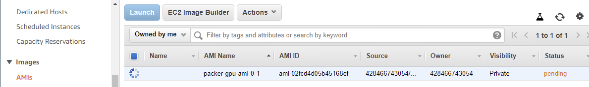
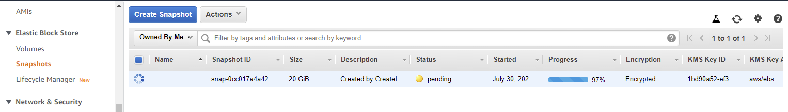
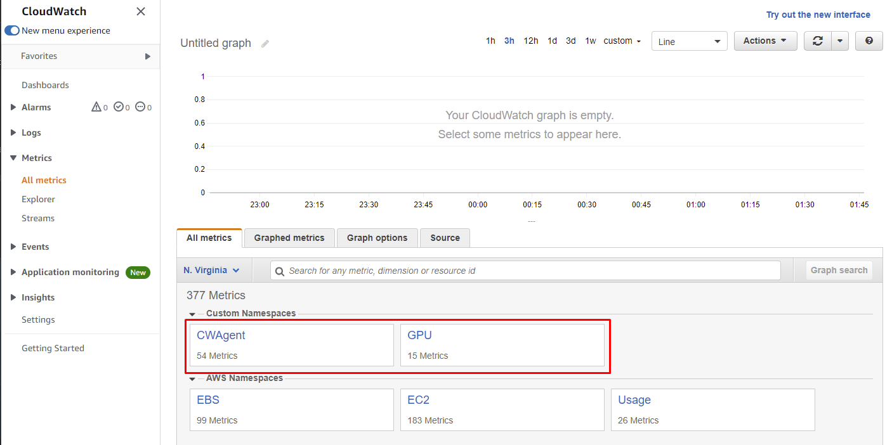
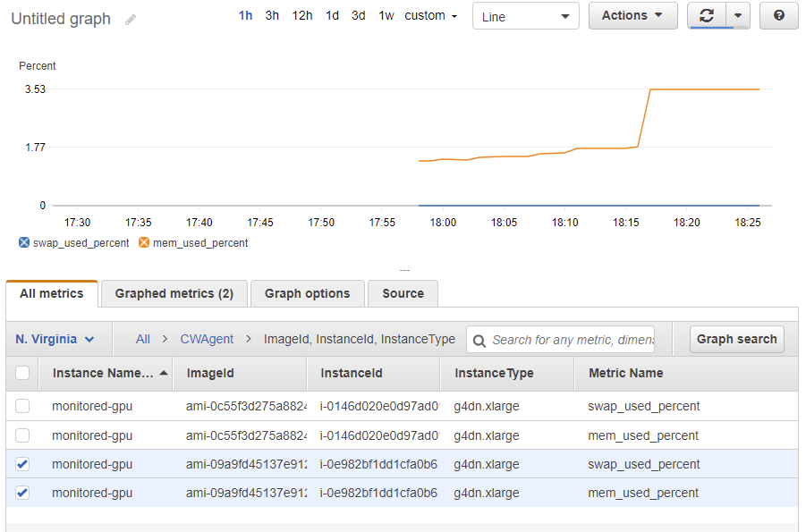
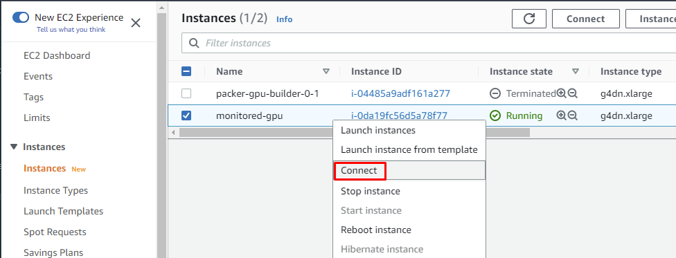
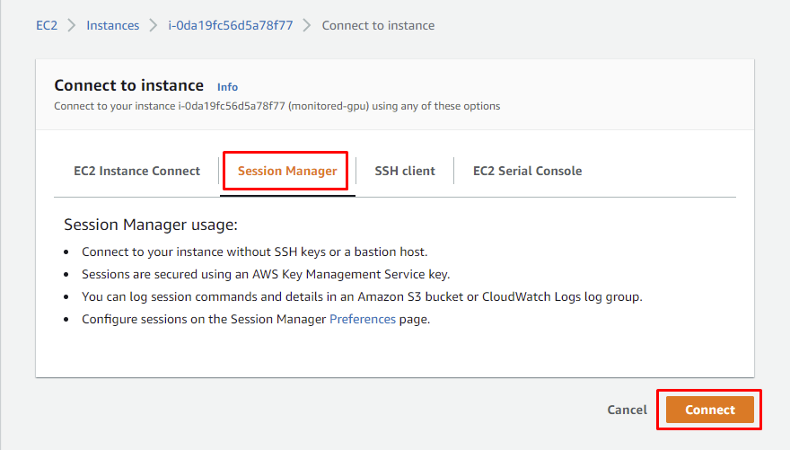
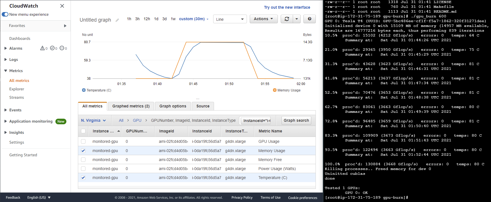
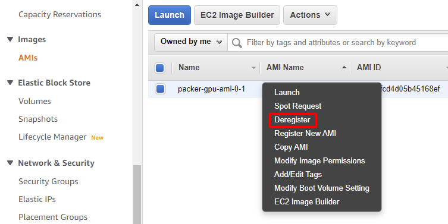
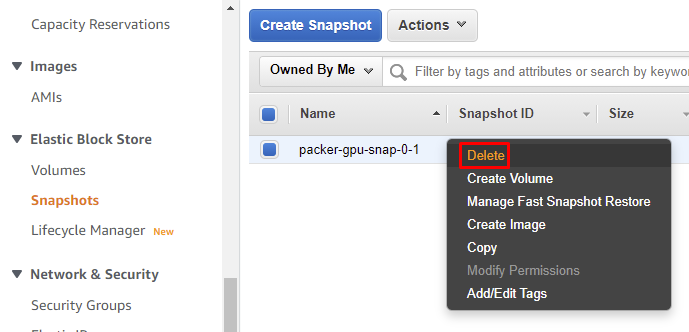

# Instrumenting AMIs for GPU monitoring on CloudWatch

This project contains the code necessary to build an AWS AMI with monitoring
capabilities of GPU usage (among other metrics) using CloudWatch.

If you have used provisioned instances on AWS before, you know that the default metrics monitored
are kind of limited. You only have access to CPU utilization, network transfer rates and
disk reads/writes. By default, you don't have the monitoring of some basic information, like
RAM and filesystem usage (which ca be a very valuable information to prevent an instance
malfunction due to lack of resources).

In case of GPU-accelerated applications (like Machine Learning apps), this problem goes even
further, since you also don't have any access to GPU metrics, which is critical to
guarantee the reliability of the system (e.g. the total GPU memory consumption can lead to
the crash of any application running on the GPU).

In this project we create an AMI with CloudWatch agent for RAM and filesystem monitoring, and
a custom service called `gpumon` to gather GPU metrics and send them to AWS CloudWatch

## Project structure

In this project we have two main directories like this:

```
.
├── packer  ==> AMI creation
└── tf      ==> AMI usage example
```

The first one contains all the necessary files to create the the AMI based on Amazon Linux 2
using a tool called `packer`. The second one has infrastructure as code in `terraform` to
provision an instance using the new created AMI for testing purposes.

## AMI creation

`packer` is a great tool to achieve Infrastructure as Code principles on AMI creation step.
It has capabilities to provision an instance with the base AMI specified, run scripts through ssh,
start the process of AMI creation, and clean everything up (e.g. instance, ebs volume, ssh key pair)
afterwards.

The file `packer/gpu.pkr.hcl` contains the specification of the AMI. There we can find the base AMI,
the instance used to create the AMI, the storage configuration, and the scripts used to configure
the instance.

### Base AMI

In order to make my life a bit easier, I tried to to look for AMIs that already have NVIDIA drivers
installed, so that I don't have to install it my self. Looking through the
[AWS documentation about installing NVIDIA drivers](https://docs.aws.amazon.com/AWSEC2/latest/UserGuide/install-nvidia-driver.html#preinstalled-nvidia-driver),
we can see that there are options already in the marketplace of AMIs with pre-shipped NVIDIA
drivers. Among the options, we're going to use the [Amazon Linux 2](https://aws.amazon.com/marketplace/pp/prodview-64e4rx3h733ru?qid=1627738530182&sr=0-3&ref_=srh_res_product_title), because it already comes with
the AWS Systems Manager agent, which se will use latter on.

A couple of notes:

- You don't need to subscribe to the marketplace product in order to have access to the AMI
currently selected. However, you will need to subscribe to have access to the AMI id of
new releases.

- You will **need a GPU-based instance** to build the AMI (as it's required by the marketplace
product specifications). I've tested this project in a new AWS account and it seems that
the default limits doesn't allow the provisioning og GPU-based instances (G family). `packer` will
show an error if that's your case as well. If it is, you can request a limit increase
[here](http://aws.amazon.com/contact-us/ec2-request).

### CloudWatch Agent

The first addon that we're going to make to the base AMI is to install and configure
the AWS CloudWatch Agent.

The process of installation of the agent is well documented by AWS and
you can see more details and methods of installation in other Linux distributions
[here](https://docs.aws.amazon.com/AmazonCloudWatch/latest/monitoring/install-CloudWatch-Agent-commandline-fleet.html).

The agent configuration is made by `.json` file that the agent reads in order to know what metrics
to monitor and how to publish them on ClodWatch. You can also see more about it on the
[documentation page](https://docs.aws.amazon.com/AmazonCloudWatch/latest/monitoring/CloudWatch-Agent-Configuration-File-Details.html).

The process is automated by the script `packer/scripts/install-cloudwatch-agent.sh`. It installs the
agent and configure it with some relevant metrics like filesystem, RAM and swap usage.

> Note that the agent is configured to publish metrics with a period of 60 seconds. This can incur
> costs since it's considered and Detailed metric (go to
> [CloudWatch pricing page](https://aws.amazon.com/cloudwatch/pricing/) to know more).

### Gathering the GPU metrics

AWS already have
[documentation](https://docs.aws.amazon.com/dlami/latest/devguide/tutorial-gpu-monitoring.html)
talking about ways to monitor GPU usage. There is a
[brief description](https://docs.aws.amazon.com/dlami/latest/devguide/tutorial-gpu-monitoring-gpumon.html)
about a tool called `gpumon` and also a more extended
[blog post](https://aws.amazon.com/blogs/machine-learning/monitoring-gpu-utilization-with-amazon-cloudwatch/)
about it.

`gpumon` is a (kind of old)
[python script](https://s3.amazonaws.com/aws-bigdata-blog/artifacts/GPUMonitoring/gpumon.py)
developed by AWS that makes use of a NVIDIA library called NVLM (NVIDIA Management Library)
to gather metrics from the GPUs of the instance and publish them on CloudWatch. In this project
the script was turned into a `systemd` unit. The script itself was also modified to make
the error handling more readable and to capture memory usage correctly.

The `gpumon` service resides in `packer/addons/gpumon` and the `install-cloudwatch-gpumon.sh`
automates the installation process. The service is configured to start the python script at boot
and restart it stops working for some reason. Since `systemd` manages the service, its logs can
be seen with `journalctl --unit gpumon`.

> **Note**: he python script has only be tested on python2, which [is deprecated](https://www.python.org/doc/sunset-python-2/).
> `pip` warns about that on the installation process while you create the AMI. You should
> keep that in mind if you intend to use this script for any production workload.

#### About the GPU memory usage metric gathering

The [original script](https://s3.amazonaws.com/aws-bigdata-blog/artifacts/GPUMonitoring/gpumon.py)
get the GPU memory usage from the `nvmlDeviceGetUtilizationRates()` function. I noticed through
some tests that this metric was 0 even though I had data loaded into the GPU.

From the
[NVIDIA documentation](https://docs.nvidia.com/deploy/nvml-api/group__nvmlDeviceQueries.html#group__nvmlDeviceQueries_1g540824faa6cef45500e0d1dc2f50b321)
this function actually
[returns](https://docs.nvidia.com/deploy/nvml-api/structnvmlUtilization__t.html#structnvmlUtilization__t)
the amount of memory that is being read/written, which isn't what I wanted. In order to get the
amount of GPU memory allocated,
[`nvmlDeviceGetMemoryInfo()`](https://docs.nvidia.com/deploy/nvml-api/group__nvmlDeviceQueries.html#group__nvmlDeviceQueries_1g2dfeb1db82aa1de91aa6edf941c85ca8)
should be used instead.

## AMI Usage example

As an example on how to use this AMI, there is also a terraform project that contains the
necessary resources to provision an instance and monitor it using the CloudWatch interface.

The `tf/main.tf` is the root file containing the reference to the module `tf/module/monitored-gpu`,
which encapsulates the resources such as the instance and IAM permissions.

This example doesn't required SSH capabilities from the instance.
We will use AWS Systems Manager - Session Manager to access of the instance
(the base AMI already comes with the SSM agent preinstalled). This method is better because
the access is registered into AWS, allowing security auditions on the instance access. Also,
there is no credentials nor keys stored in any machine to be leaked.

The required AWS managed permissions are:

- `CloudWatchAgentServerPolicy`: allow the instance to publish CloudWatch metrics;
- `AmazonSSMManagedInstanceCore` instance access through Session Manager.

## How to run it

All right, let's go to the fun part! To play with this project we first need to install some
dependencies (`packer` and `terraform`).

A really handy tool that you can use to install and manage multiple versions of tools
is `asdf`. It helps you keep track use different versions of a variety of tools. With it
there is no need for you to uninstall the versions of the tools you may already have. With some
simple commands it install the versions needed and make them context aware (the tolling version
change automatically after entering in a directory that has a `.tool-versions` specified).

You can go to [this link](https://asdf-vm.com/guide/getting-started.html) to install `asdf`. After
that you can simply run the following to have the correct versions of `packer` and `terraform`:

```
asdf plugin-add terraform https://github.com/asdf-community/asdf-hashicorp.git
asdf plugin-add packer https://github.com/asdf-community/asdf-hashicorp.git

asdf install
```

After that, it's time to build the AMI:

```
cd packer
packer init
packer build .
```

This will start the process of building the AMI in the `us-east-1` region. You can follow the
terminal to see what is happening and the logs of the scripts. You can also see the snapshot
being taken accessing the AWS console:



And get a progress bar in the "Snapshots" page like this:



> The snapshot name tag will appear after the AMI has been created.

The AMI creation will be completed when you see something like this on your terminal:

```
...
==> amazon-ebs.gpu: Terminating the source AWS instance...
==> amazon-ebs.gpu: Cleaning up any extra volumes...
==> amazon-ebs.gpu: No volumes to clean up, skipping
==> amazon-ebs.gpu: Deleting temporary security group...
==> amazon-ebs.gpu: Deleting temporary keypair...
Build 'amazon-ebs.gpu' finished after 9 minutes 38 seconds.

==> Wait completed after 9 minutes 38 seconds

==> Builds finished. The artifacts of successful builds are:
--> amazon-ebs.gpu: AMIs were created:
us-east-1: ami-09a9fd45137e9129e
```

:white_check_mark: At this point, you should have an AMI ready to be used!!

Now it's time to test it! Grab the AMI id (`ami-09a9fd45137e9129e` in this case) and paste it,
replacing the text `"<your-ami-id>"` in the `tf/main.tf` file. After the modification, the section
of the file that specifies the module should look like this:

```terraform
module "gpu_vm" {
  source = "./modules/monitored-gpu"

  ami = "ami-09a9fd45137e9129e"
}
```

After that, just run:

```
cd tf
terraform init
terraform apply
```

`terraform` will ask you if you want to perform the actions specified. If, right before the
prompt, it shows that it will create 6 resources, like it's being shown right below,
you can type `yes` to start the resource provisioning.

```
...
Plan: 6 to add, 0 to change, 0 to destroy.
...
```

After a couple of minutes (roughly 5 minutes), go to the *All metrics* page on CloudWatch. You
should be able to see two new custom namespaces already: `CWAgent` and `GPU`. This is the newly
created instance publishing its metrics in idle.



You can see more details about RAM and swap, for example, using the `CWAgent` namespace, like
the next figure shows. With that you can monitor the boot behavior of the AMI, assess
its performance and verify if it's behaving as expected.



The swap usage is 0 because
there is no swap configured in this AMI (you can follow
[this documentation](https://aws.amazon.com/premiumsupport/knowledge-center/ec2-memory-swap-file/)
in order to add it). The spike of RAM usage you see is a test that I was making :sweat_smile:.

Now, let's use this hardware a bit to see the metrics moving. Go to the *Instances* tab on the EC2
page, like shown in the next figure. Right-click in the running instance and hit connect.



After that, go to the *Session Manager* tab and hit *Connect*.



You should now have a shell access through your browser. Running the commands below will
clone and build an utility to stress-test the GPU for 5 minutes.

```
sudo -s
yum install -y git

cd ~
git clone https://github.com/wilicc/gpu-burn.git
make CUDAPATH=/opt/nvidia/cuda

./gpu_burn 600
```

You can look at CLodWatch to see the impact of the resource usage while `gpu-burn` does its thing,
as shown in the figure below.

With these metrics, now it's easy to create alarms to alert you when an anomaly is detected on
the resource usage, or create autoscaling capabilities for a cluster using custom metrics.



## Clean up

To finish the party and turn off the lights, just:

- run `terraform destroy` while at the `tf/` directory;

- deregister ami;



- and delete the EBS snapshot.


